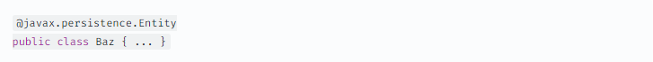
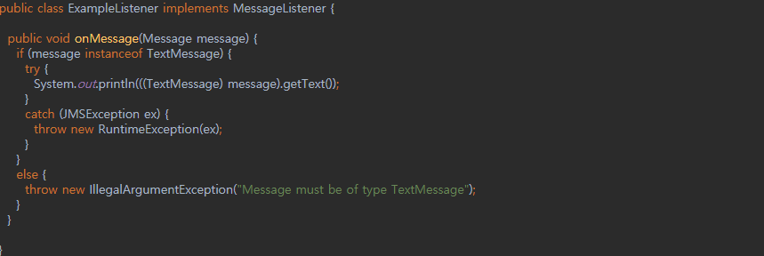
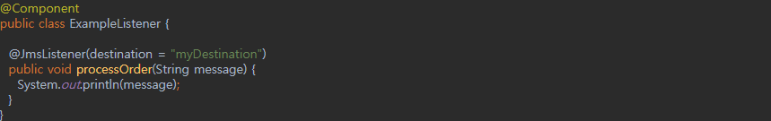

### POJO

- 정의
    - Plain Old Java Object
    - 오래된 방식의 간단한 자바 오브젝트
    - 특정 자바 모델이나 기능, 프레임워크 등을 따르지 않은 자바 오브젝트를 지칭
- 등장배경
    - EJB의 등장
        - EJB (Enterprise JavaBeans)는 기업환경의 시스템을 구현하기 위한 서버측 컴포넌트 모델
        - 기업의 IT 시스템에서 요구가 늘어나면서, 자바의 기초적인 JDK로는 한계가 존재
        - 비즈니스 로직이 복잡해졌고, 사용자의 처리요구를 빠르고 안정적이면서 확장 가능한 형태로 유지하기 위해 로우레벨의 기술적인 처리가 요구됨
        - 이 때, EJB가 '애플리케이션 개발을 쉽게 만들어주겠다. 애플리케이션 개발자는 로우레벨의 기술에 관심을 가질 필요가 없다'며 등장함
    - EJB의 한계점
        - 여러 문제가 있었지만, 가장 최악의 문제점은 EJB 스펙을 따르는 비즈니스 오브젝트들은 객체지향적인 특징과 장점을 포기해야 한다는 것
        - 상속X, 다형성X
    - POJO의 등장
        - 2000년 9월에 마틴 파울러, 레베카 파슨, 조쉬 맥킨지가 강연을 준비하던 중 POJO를 떠올림
            - EJB보다는 단순한 자바 오브젝트에 비즈니스 로직을 넣어 사용하는 것이 더 많은 장점이 있는데 사람들은 왜 사용하지 않을까?
            - 단순한 오브젝트에 멋진 이름이 없어서 그런 것이다. → POJO의 탄생
- POJO 기반의 프레임워크
    - EJB 이전의 방식 ≠ POJO → 이전으로 돌아가면 동일한 문제 발생
    - POJO의 가치는 자바의 객체지향적인 특징을 살려 비즈니스 로직에 충실한 개발이 가능하도록 하는 것
    - POJO를 이용한 애플리케이션 개발이 가진 특징과 장점을 살리면서 EJB에서 제공하는 엔터프라이즈 서비스와 기술을 그대로 사용할 수 있도록 도와줌
    - ex) Hibernate, Spring
- 조건
    - 객체지향 원리에 충실함
    - 특정 규약에 종속되지 않음
    - 특정 환경에 종속되지 않음
- POJO가 하면 안 되는 것
    - 미리 지정된 클래스를 확장(extends)하는 것

        

    - 미리 정의된 인터페이스를 구현(implement)하는 것

        

    - 미리 정의된 Annotation을 포함하는 것

        
        - 다만 Annotation의 경우, 많은 소프트웨어나 프레임워크에서 영속성(Persistence)과 같은 기능이 제대로 작동할 수 있도록 Annotation을 사용하게끔 하기도 함

- 예시
    - POJO **(X)**
    - 특정 메시징 솔루션(JMS)의 인터페이스를 구현하고 있음
    - 즉, 해당 인터페이스에 '종속'되어 있는 것

    

    - POJO **(O)**
    - 'JMS'와 관련된 확장 코드가 보이지 않음
    - 'JMS'와 커넥션을 연결하고 메시지를 처리하는 책임은 모두 어노테이션에 위임

    
    - Annotation도 사용하지 않는 진정한 POJO의 예시로는 DTO가 존재

- 장점
    - 객체지향적 설계의 자유로운 사용
        - 특정 규약에 종속되지 않아 객체지향 설계 가능
    - 코드의 간결함
        - 특정 규약에 종속되지 않아 로우레벨 코드와 비즈니스 코드가 분리됨
    - 자동화 테스트에 유리함
        - 특정 환경에 종속되지 않아 테스트하기 좋음
- POJO 기반의 코드인지 판별하는 기준
    - 객체지향적인 설계원칙에 충실하도록 개발되어 있는지
        - 객체지향언어로서의 자바 오브젝트 특징을 가지고 있는가?
        - 즉, 확장이나 재활용이 가능한가?
    - 테스트 코드 개발의 용이성 혹은 테스트 코드를 잘 작성했는지
        - 자동화된 테스트 코드 작성이 편리한가?
        - POJO로 잘 설계된 코드는 테스트 코드를 쉽게 만들 수 있게 해줌
        - 잘 만들어진 테스트 코드는 지속적인 변화에 유연하게 대응하게 해줌