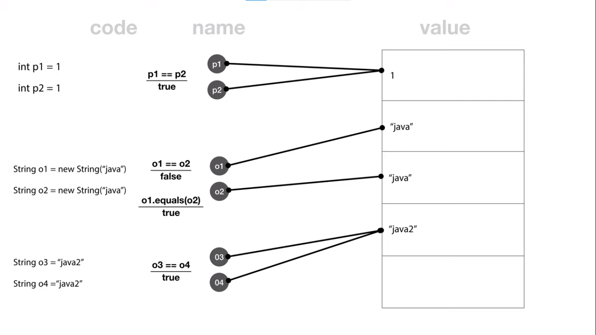

### 메모리 구조 (Method, Heap, Stack)

- 자바 프로그램은 JVM을 통해 실행되는데, JVM은 OS로부터 필요한 메모리를 할당받음
- Method
    - 자바 프로그램에서 사용되는 클래스의 정보 및 클래스 변수를 저장함
    - 프로그램의 시작부터 종료까지 메모리에 남기 때문에, 전역변수 및 static 변수를 프로그램 종료 때까지 사용이 가능함
- Heap
    - 인스턴스 변수를 저장함 (new 연산자를 통해 생성된 인스턴스의 정보)
    - 참조형 데이터 타입을 갖는 객체와 배열을 저장함
    - 가비지 컬렉터가 회수하기 전까지 메모리가 유지됨
    - 메모리의 낮은 주소에서 높은 주소의 방향으로 할당함
- Stack
    - 메소드가 호출될 때 메소드의 호출과 관계되는 지역변수 및 매개변수, 리턴값을 저장함
    - 해당 메소드가 호출될 때 메모리에 할당되고, 종료되면 소멸됨
    - 각 스레드 당 1개의 Stack을 가짐
    - 후입선출 (LIFO)
    - 메모리의 높은 주소에서 낮은 주소의 방향으로 할당함

### == VS equals

- 기본형(primitive type)은 같은 내용이면 같은 주소를 참조하기 때문에 ==로 동등비교가 가능함
- 참조형(reference type)의 경우 같은 내용이더라도 주소가 달라져 ==로는 같은 내용인지 확인할 수 없기 때문에 equals()를 사용해야 함
- 그러나 String의 경우 new로 생성하지 않고 직접 할당한다면, 특별하게 ==로도 동등비교가 가능함 (인자를 따로 입력 받은 경우는 불가)