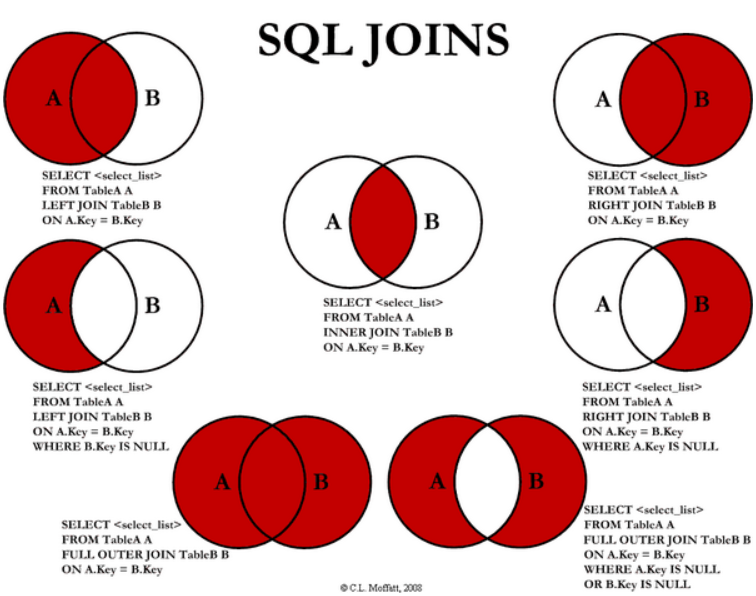

## JOIN

### 1. Inner Join

- 테이블 간 서로 연결되는 값만 출력
- 교집합, 공통적인 부분만 select

### 2-1. Left Join

- A, B 테이블 중에서 A값의 전체와 A의 Key와 B의 Key가 같은 결과를 출력
- left에 있는 것 다 selct

### 2-2. Left Join (IS NULL)

- 순수 A의 값만 출력
- left에 있는 것만 select
- A-B
- SELECT *
FROM A
LEFT JOIN B
ON A.ID = B.ID
WHERE B.ID IS NULL

### 3-1. Right Join

- A, B 테이블 중에서 B값의 전체와 A의 Key와 B의 Key가 같은 결과를 출력
- right에 있는 것 다 selct

### 3-2. Right Join (IS NULL)

- 순수 B의 값만 출력
- right에 있는 것만 select
- B-A
- SELECT *
FROM B
LEFT JOIN A
ON A.ID = B.ID
WHERE A.ID IS NULL

### 4-1. Outer Join

- A 테이블 값 전체와 B 테이블 값 전체를 둘 다 출력
- SELECT *
FROM A
FULL OUTER JOIN B
ON A.ID = B.ID
- MySQL에는 FULL OUTER JOIN이 없어서 LEFT JOIN과 RIGHT JOIN을 UNION으로 묶어 사용함
    - SELECT *
    FROM A
    LEFT JOIN B
    **UNION**
    SELECT *
    FROM A
    RIGHT JOIN B

### 4-2. Outer Join (IS NULL)

- FULL OUTER가 가지고 있는 값 중 공통적인 부분을 제외한 값을 출력
- SELECT *
FROM A
FULL OUTER JOIN B
ON A.ID = B.ID
WHERE A.ID IS NULL OR B.ID IS NULL

### 5. SELF JOIN

- 원하는 데이터들이 하나의 테이블에 있을 때 사용함
- SELECT *
FROM A A
JOIN A B
ON 조건