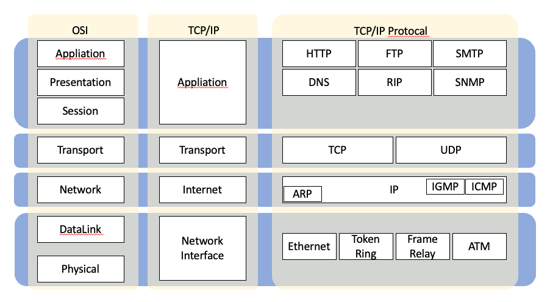

`아직 명확하게 이해할 수 없어서 제외한 부분들이 존재함`

## 프로토콜과 소켓

### 1. Protocol

- 프로토콜 : 통신규약. 컴퓨터들 간의 원활한 통신을 위해 지키기로 약속한 규약
- TCP/IP Protocol

    

- HTTP
    - Hyper Text Transport Protocol
    - 인터넷 상에서 데이터를 주고 받기 위해 클라이언트와 서버 사이에 이루어지는 요청/응답 프로토콜
    - 주로 HTML 문서를 주고 받는 데 쓰임
    - 클라이언트의 요청이 있을 때 서버가 해당 페이지에 대한 데이터를 전송하고 곧바로 연결을 끊는 방식
        - 서버와의 연결을 유지하지 않으므로 서버의 과부하를 줄여줄 수 있음
    - 인터넷 상에서 통신한 패킷을 보면 평문이 그대로 노출되어 보안에 취약하다는 점을 보완해 HTTPS가 등장함
- FTP
    - File Transfer Protocol
    - 인터넷 상에서 파일을 주고 받기 위해 클라이언트와 서버 사이에 이루어지는 요청/응답 프로토콜
    - 제어 연결과 데이터 연결로 구분됨
- +) FTP는 자신이 작업하기 원하는 파일을 작업하는 동안 서버와 계속 연결되어 있으나 HTTP는 연결과 연결 해제를 반복한다는 차이점이 존재함

### 2. Socket

- 클라이언트와 서버가 연결이 되면 어느 한 쪽에서 강제로 접속을 해제하기 전까지 계속 연결을 유지하는 방식
- 실시간으로 데이터를 주고 받을 때 사용됨
- 서버의 성능에 따라 연결할 수 있는 클라이언트의 개수가 제한되어 있음
- TCP 방식과 UDP 방식으로 나뉨
    - TCP/IP 프로토콜 기반의 Stream 방식
        - 양방향 연결
        - 데이터의 신뢰성 보장
        - 한 개의 패킷을 여러 개로 나누어 받거나 여러 개의 패킷을 하나로 받을 수 있으므로 별도의 처리가 필요함
    - UDP/IP 프로토콜 기반의 Datagram 방식
        - 양방향 연결이 필요 없음
        - 데이터의 소실이 발생할 수 있음
        - 한 개의 데이터를 여러 개로 분할하지 않고 받을 수 있음