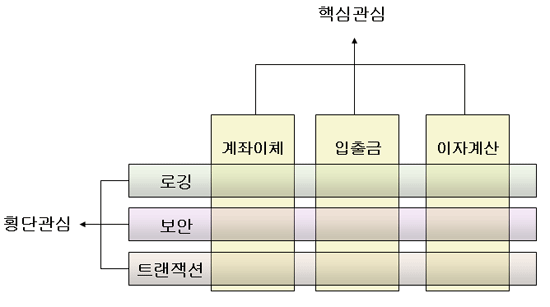

## AOP (Aspect Oriented Programming, 관점 지향 프로그래밍)

- OOP와 반대되는 개념이 아니고, OOP를 더욱 발전시키기 위한 개념임
    - OOP (Object Oriented Programming, 객체 지향 프로그래밍)
        - 모든 데이터를 현실에 빗대어 객체로 다루는 프로그래밍 기법
        - 비즈니스 로직을 모듈화함
        - 상속 및 위임을 통해 객체를 재사용함으로써 반복되는 코드의 양을 줄여줌
    - OOP로도 반복되는 코드를 없앨 수 없는 상황이 존재하고, 어플리케이션 전체에서 사용되는 부가기능들을 모듈화하기 어려움 → AOP의 등장
- 요구사항에 대해 핵심 관심사항과 횡단 관심사항으로 분할, 개발, 통합하여 모듈화를 극대화하는 프로그래밍 기법
    - 핵심 관심(Core Concern) : 각 서비스의 핵심 비즈니스 로직
    - 횡단 관심(Cross-cutting Concern) : 공통 모듈. 여러 객체에서 공통적으로 작성해야 하는 부분
- AOP의 핵심은 공통 모듈을 분리시켜 해당 소스코드가 외부의 다른 클래스에 존재하는 것임
    - 즉, 기능을 비즈니스 로직과 공통 모듈로 구분한 후 필요할 때 비즈니스 로직에 삽입하여 실행하는 것 → Weaving (위빙)
- 장점
    - 어플리케이션 전체에 흩어진 공통 기능이 하나의 장소에서 관리되어 중복 코드가 사라짐
    - 개발자는 핵심 비즈니스 로직에만 집중할 수 있어 코드가 간결해지고 유지보수가 쉬워짐
    - 재활용성이 더욱 높아짐
    - 생산성이 높아지고 변화를 수용하기에 용이해짐
- 구성요소
    - JointPoint : 횡단 관심을 삽입하여 실행할 시점
    - PointCut : 어떤 클래스의 어떤 함수에 삽입할 것인지. 삽입할 위치
    - Advice : 무엇을 삽입할 것인지
    - Weaving : PointCut에 의해서 결정된 JointPoint에 지정된 Advice를 삽입하는 과정
    - Aspect : Advice + PointCut
    - Proxy : 공통 기능을 수행해주는 대행자 역할